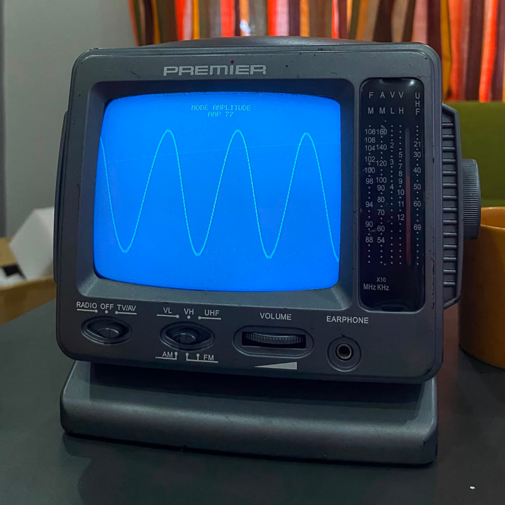
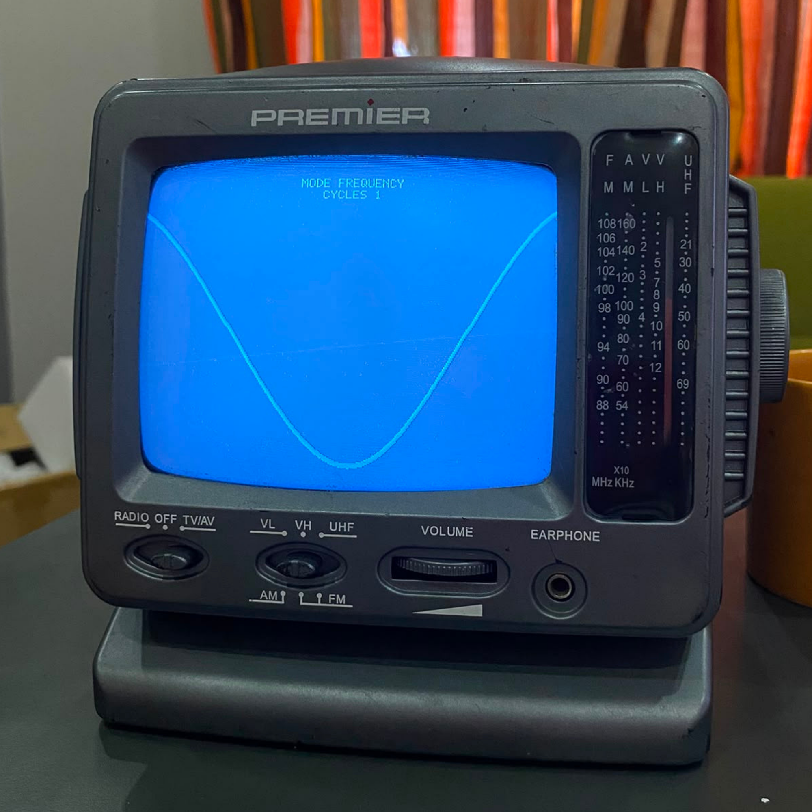
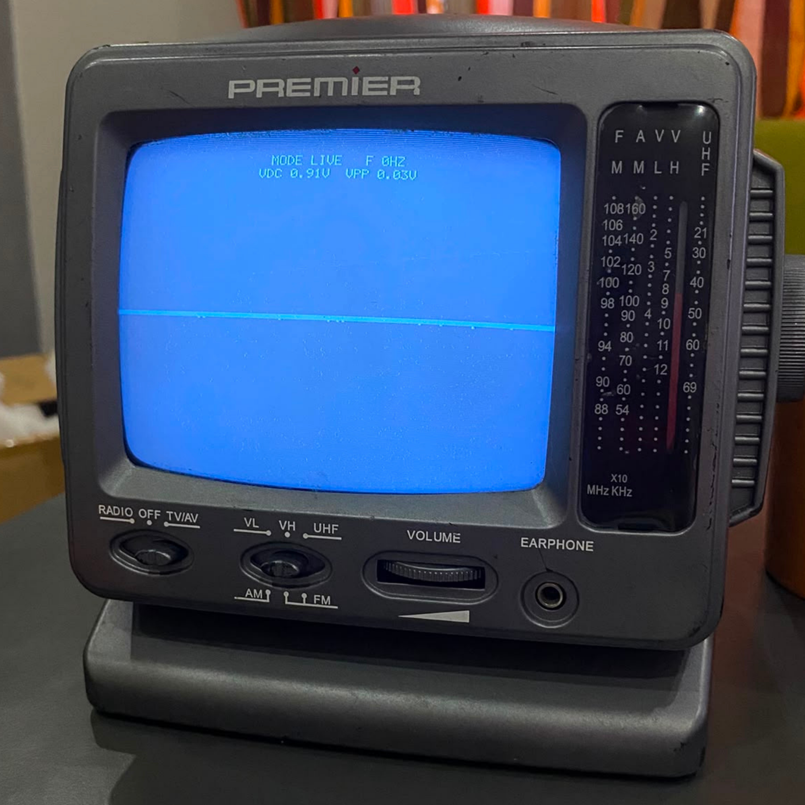

# ESP32 CRT Oscilloscope

A tiny oscilloscope built from scratch on an ESP32 that draws directly onto an
old black-and-white CRT TV over composite video (RCA). No display module — the
TV *is* the screen. It samples an analog input, renders the trace live, and
turns a potentiometer/LDR into a knob that reshapes a generated waveform.

> Built step by step, including recovering from a fried DAC pin. Video output
> runs on **GPIO26 (DAC2)** because DAC1/GPIO25 was damaged during the build.

<p align="center">
  
  
  
</p>
<p align="center">
  
  
  
</p>

## Features
- Composite (PAL) video straight from the ESP32 to a CRT TV
- Live trace on a black background, thick and readable
- Dual-core: ADC acquisition on core 1, rendering locked to the video frame on core 0
- On-screen readouts: **VDC**, **Vpp**, **frequency**
- Four modes, switched with the on-board **BOOT** button:
  - **AMPLITUDE** — pot controls the sine amplitude
  - **FREQUENCY** — pot controls how many cycles fit on screen
  - **SHAPE** — pot morphs the waveform: sine / square / triangle / saw
  - **LIVE** — plots the real signal on the ADC (mic module, RC curve, battery, etc.)

## Hardware
- ESP32-WROOM dev board (classic ESP32, needs the DAC)
- Black-and-white CRT TV with composite (RCA) input, PAL
- 1x 100 ohm resistor (video termination)
- Potentiometer (~10k) and/or LDR + ~10k resistor
- (Optional) 220 ohm + 2x 1N4148 diodes for input protection

### Wiring (summary)
| From | To |
|---|---|
| GPIO26 | Yellow RCA centre pin (video) |
| GND | Yellow RCA outer shield |
| 100 ohm | between GPIO26 line and GND (termination) |
| Signal / pot wiper / sensor | GPIO34 (ADC1_CH6) |
| BOOT button (on board) | mode switch |

Full wiring and the protected input front-end: see [docs/wiring.md](docs/wiring.md).

## Build (PlatformIO + ESP-IDF 4.4)
```bash
# 1) fetch third-party components and apply the one-line DAC patch
./scripts/setup.sh        # Windows: powershell -File scripts/setup.ps1

# 2) build & flash (PlatformIO)
pio run -t upload -t monitor
```
`platformio.ini` pins `espressif32@5.4.0`, which provides **ESP-IDF 4.4.x** — the
version the video library was tested with. Newer ESP-IDF (5.x) removes the I2S
DAC path this library relies on, so do not bump it.

## Limits (be honest with yourself)
- **0-3.3 V inputs only.** No attenuation. Never feed mains or anything above 3.3 V.
- **Low frequency.** One-shot ADC (the fast I2S path is used by video), so it is
  useful up to roughly a few kHz - great for DC, batteries, audio-ish signals,
  RC curves; not for MHz signals.
- For higher voltages add a proper high-value divider; for AC add bias + a
  coupling capacitor.

## Credits & License
Video signal generation is **not ours** - it uses
[aquaticus/esp32_composite_video_lib](https://github.com/aquaticus/esp32_composite_video_lib)
(GPL-3.0), plus [LVGL](https://github.com/lvgl/lvgl) (MIT) as a build dependency.
Everything else (acquisition, rendering, font, modes, UI, measurements) was
written for this project. Because it builds on GPL-3.0 code, this project is
**GPL-3.0-or-later**. See [CREDITS.md](CREDITS.md) and [LICENSE](LICENSE).

Turkce: [README.tr.md](README.tr.md)
